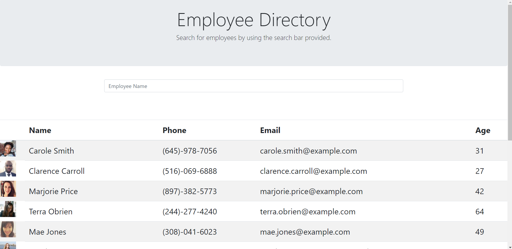
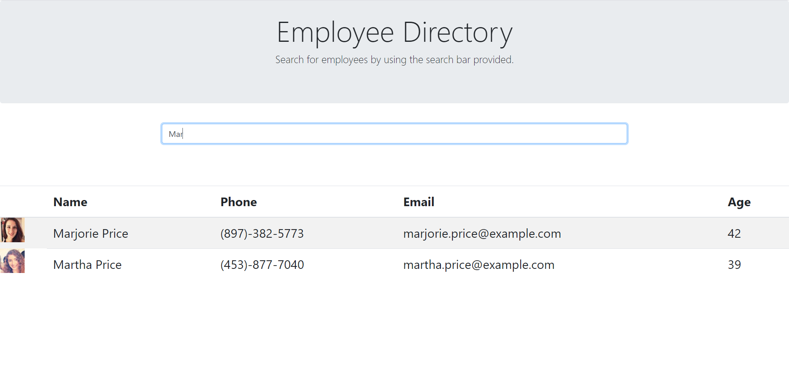

# Employee Directory

Application link:
https://fatmoogle.github.io/Employee_Directory/

## Description 

The following app is designed to show off how to create a simple React application that displays user information. Using the random person API, which is available for free on the web, you can use it to pull data that includes first and last names, age, phone numbers, emails, and more. This is all artificial data that would simulate real employees or users.

Using axios, I was able to acquire the data from the API, and submitted the "get" request via the "componentDidMount", which is a React life-cycle method that happens on page load. This way when the document is loaded, information is ready to be displayed.

WIth the data response, I set a state I had previously defined, labled simply as "employees", and had that set as an array. Then using one of JavaScripts array methods, the ".map" function, I was able to create a table dynamically for each employee that was returned by the API. 

One of the struggles in creating this appplication was the search functionality. In order for it to work properly, I had to create a seperate state object that I would label as "filteredEmployees". This way, I could maniuplate this data independantly of the original employees array. When the page loads, the "componentDidMount" function was called and I had the two state objects set: Employees and filteredEmployees. 

Using an input change handler I could then type into the input box, and during that same handler it would set the state of the filteredEmployees to be whatever was typed into the input box. The ".map" function would then filter through the employees that matched the inputs. The only issue is it currently only displays based on the first letters of the employees name in upper or lower case. If someone were to type in the third letter of someone's name for example, it would not find any employees. I plan on updating the application to include this functionality for a better user experience.

## Table of Contents 

* [Description](#Description)
* [Installation](#Installation)
* [Usage](#Usage)
* [Credits](#Credits)
* [License](#License)
* [Contributions](#Contributions)
* [Tests](#Tests)
* [Questions](*Questions)

## Installation

No installation needed! You can follow this link to the application:
https://fatmoogle.github.io/Employee_Directory/

## Usage

Just follow the link above to the application!

## Credits

In order to simulate an API call and get random and fake employee information, I used Random User API:
https://randomuser.me/api

## License

MIT

## Contributing

Open Source! Use for any of your own projects.

## Tests

No tests were created for this application.

## Questions

Contact me through GitHub or email!

Reach out to me!

Email: alexvar93@gmail.com
GitHub Profile: Fatmoogle || github.com/Fatmoogle 

---
© 2020 Trilogy Education Services, a 2U, Inc. brand. All Rights Reserved.

